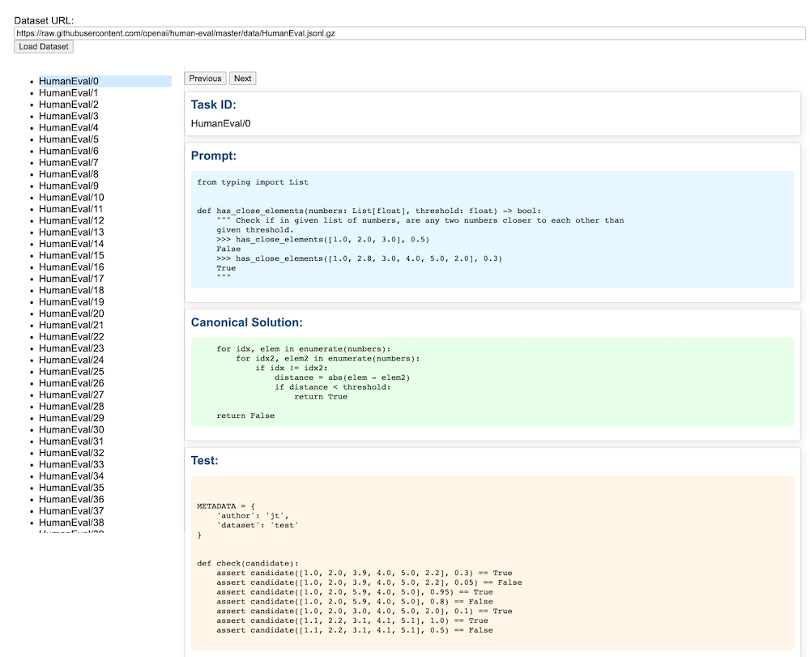

# HumanEval Browser

Browsing [HumanEval dataset](https://github.com/openai/human-eval/tree/master/data) is kind of a pain (even with `jq`) so let's see what ChatGPT (with Netlify plugin) can do.

Here is what it came up with https://stately-moonbeam-442e4d.netlify.app/

The original prompt https://chat.openai.com/share/9b9cfd5d-eb6a-4636-8906-2e5231af84ef